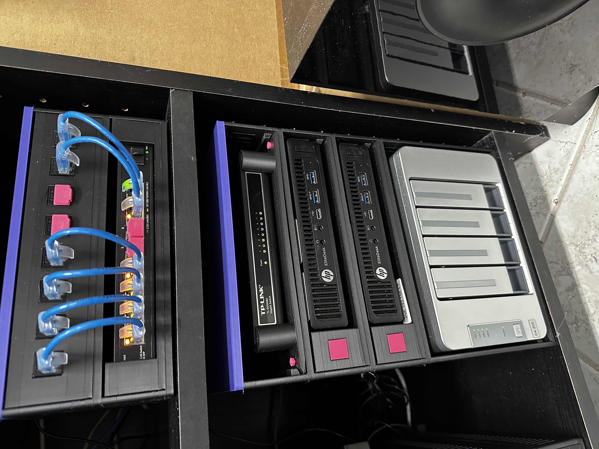

# QuitoShelf
Light duty 3D printable shelves for electronics and computers

   

Instructions
------------
You need to install OpenSCAD (openscad.org).

1.In OpenSCAD, you need to create: a shelf (create using Shelf.scad),
a plate (create using QuickRelease*Plate.scad) and
some optional accessories (create using Accessories.scad).

Shelves all have the same foot print. So they are stackable. The height is customizable. I
test mostly with 40mm(Slim) and 50mm(Standard). You can optionally connect the shelves
side-by-side using the Side Clip Accessories.

2. 3D Print the shelf, plate, accessories
3. Mount the equipment in the plate. You may need mounting screws (Accessories or M4).
4. Slide the plate into the shelf
5. (Optional) Secure the plate to the shelf using Plate Stoppers (Accessories or M3).

Makefile
--------
The Makefile create a big set of shelves, plates and accessories.

Libraries used in the project
-----------------------------
Metric Screws by Ryan A. Colyer
https://github.com/rcolyer/threads-scad/blob/master/threads.scad

Keystone Mount code is by Patrick762
https://makerworld.com/en/models/1261753-keystone-mount?from=search#profileId-1286510

Other useful Models
-------------------
Keystone Blank by tyler
https://www.printables.com/model/35813-keystone-wall-plate-blank/comments

RJ 45 Port Cap by mfischer79
https://www.printables.com/model/466718-ethernet-rj45-coverplugcap

Inspirations
------------
Printable 10" rack by MandicReally
https://www.youtube.com/watch?v=5E0M4s17r-U

Stackable Crate by Kai
https://www.printables.com/model/1182996-stackable-crate

